## Advanced Lane Finding Project writeup

[//]: # (Image References)

[image1]: ./examples/undistort_output.png "Undistorted"
[image2]: ./test_images/test1.jpg "Road Transformed"


### Camera Calibration

The code for this step is contained in the first code cell of the IPython notebook located in [Advanced-Lane-Lines.ipynb](Advanced-Lane-Lines.ipynb).

I start by preparing "object points", which will be the (x, y, z) coordinates of the chessboard corners in the world. Here I am assuming the chessboard is fixed on the (x, y) plane at z=0, such that the object points are the same for each calibration image.  Thus, `objp` is just a replicated array of coordinates, and `objpoints` will be appended with a copy of it every time I successfully detect all chessboard corners in a test image.  `imgpoints` will be appended with the (x, y) pixel position of each of the corners in the image plane with each successful chessboard detection.  

I then used the output `objpoints` and `imgpoints` to compute the camera calibration and distortion coefficients using the `cv2.calibrateCamera()` function.  I applied this distortion correction to the test image using the `cv2.undistort()` function and obtained this result: 

![alt text][image1]

### Pipeline (single images)

#### 1. Undistorting
To demonstrate this step, I will describe how I apply the distortion correction to one of the test images like this one:
![alt text][image2]

#### 2. Perspective transformation (birds eye view)
For obtaining the perspective transformation matrix I only selected the `straight_line*` images.
The code for my perspective transform includes a helper function called `get_straight_lines()` from *project 1 (finding lanes)* which returns two straight lines, one for the left and one for the right.
A very important parameter for this function to give good results is the `roi_height`, which I manually set to `0.63`, which means that only pixels from `0.63*ysize <= y <= ysize` are considered in straight line search.

With those lines I calculate my `src` points in the unwarped image.
```python
    lines2 = get_straight_lines(undist)
    draw_lines(line_img, lines2, color=[255, 0, 0], thickness=10)
    
    combined_img = weighted_img(line_img, image)

    left_x1,  left_y1,  left_x2,  left_y2  = lines2[0][0]
    right_x1, right_y1, right_x2, right_y2 = lines2[1][0]
    src = np.array([[left_x1,  left_y1],
                    [right_x1, right_y1],
                    [right_x2, right_y2],
                    [left_x2,  left_y2]], dtype=np.float32)
```

The corresponding `dst` points in the warped image are just the image corners moved by `offset` on the x-axis towards the middle of the image. I chose an offset of `300` pixels which worked very reasonable for the videos `project_video.mp4` and `challenge_video.mp4`. In video `harder_challenge_video.mp4` this value must be way higher for not cutting off the road markings in those extreme curves.

```python
    dst = np.array([[offset,        0],
                    [xsize-offset,  0], 
                    [xsize-offset,  ysize],
                    [offset,        ysize]], dtype=np.float32)
```

This resulted in the following source and destination points:

| Source        | Destination   | 
|:-------------:|:-------------:| 
| 572,  468      | 300, 0       | 
| 712,  468      | 980, 0       |
| 1100, 720      | 980, 720     |
| 205,  720      | 300, 720     |

For later usage I also calculated the inverse transformation from warped space to unwarped space.
```python
    M = cv2.getPerspectiveTransform(src, dst)
    Minv = cv2.getPerspectiveTransform(dst, src)
```    
After calculating indivudual `M` and `Minv` for all `straight_line*.jpg` images, I averaged them.

I verified that my perspective transform was working as expected by drawing the straight lines and the `src` and `dst` points onto a test image and its warped counterpart to verify that the lines appear parallel in the warped image.

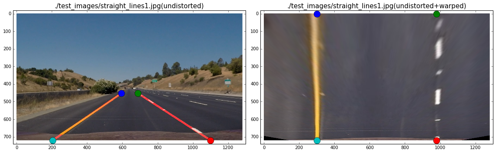


#### 3. Segmentation of lane lines

##### Choice of colour channels
I used a combination of color thresholds on channels in different colour spaces to generate a binary images.
In order to find out which colour channel describes the white and yellow lines best I considered the colour channels of the colour spaces RGB, HLS and LAB. I selected some example images, converted them to the mentioned colour spaces and plotted all available colour channels for visualisation purpose.

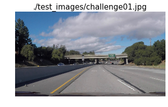
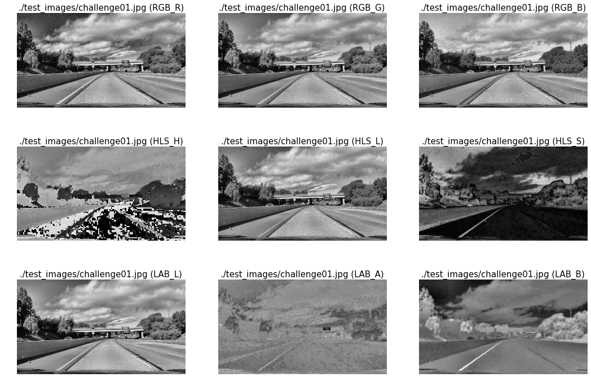

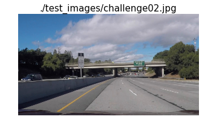
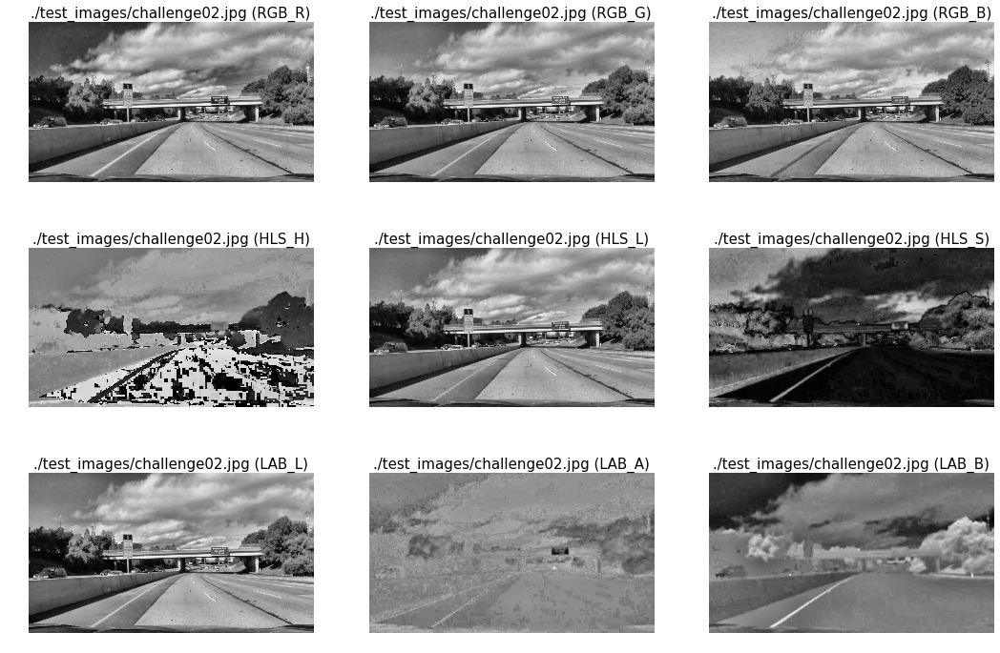

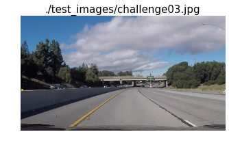
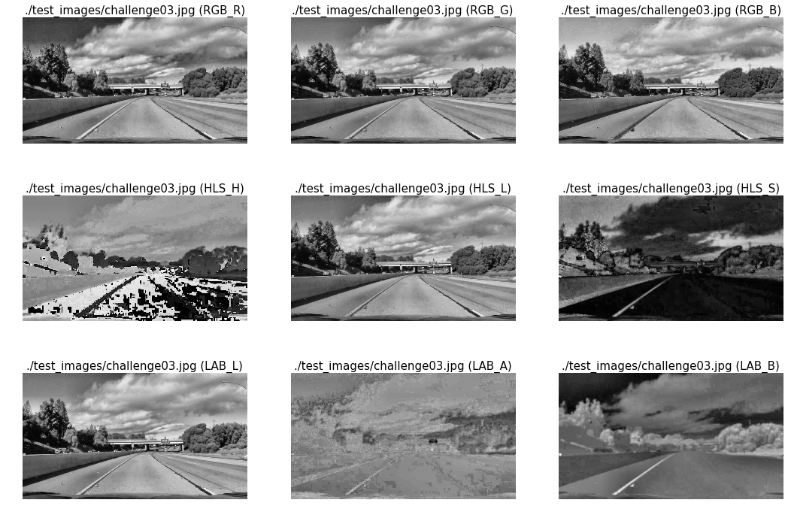

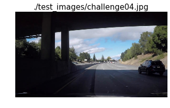
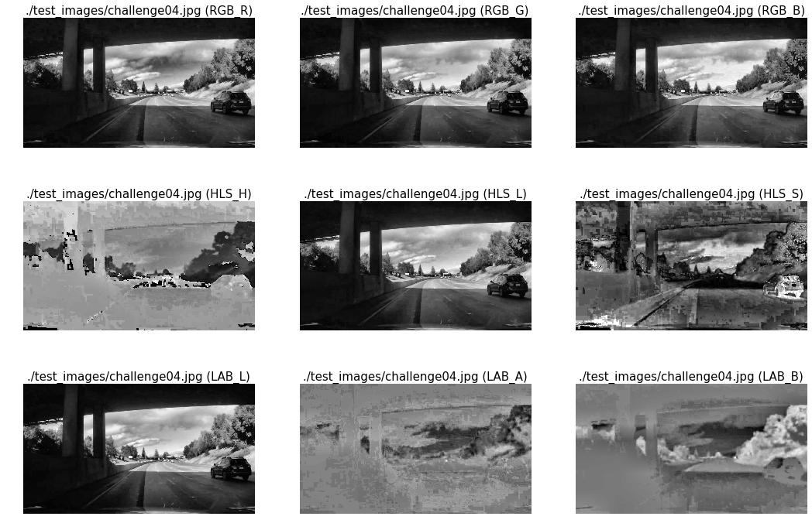

In the end I chose the L channel of the HLS colour space for detecting white lines and the B channel of the LAB colour space for detecting yellow lines. Both thresholded channels are then combined with the logical OR into one binary segmented image.
Here are some examples:

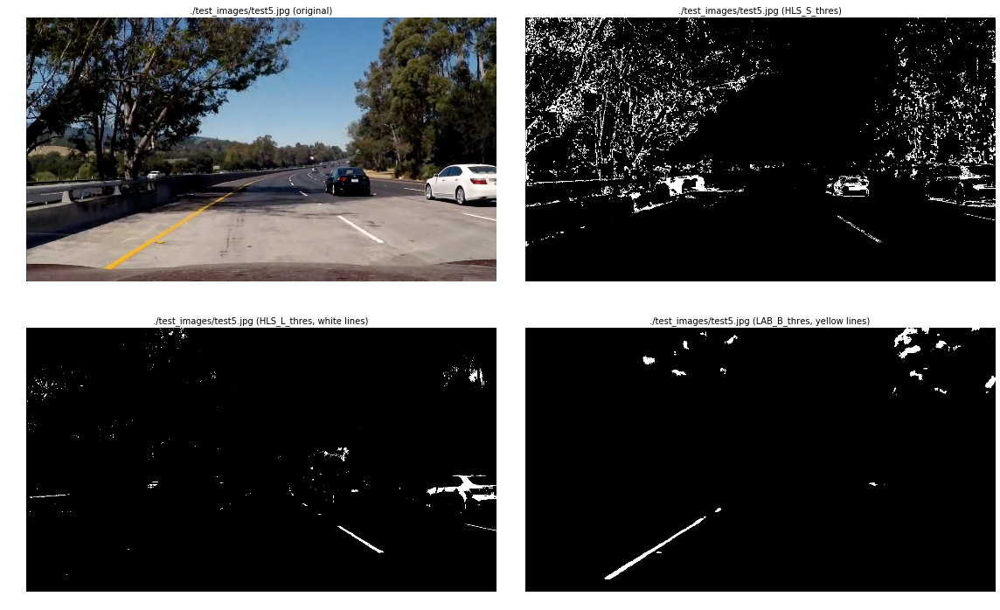


##### Image histogram equalization
In order to be invariant to exposure deviations of the camera images I employed adaptive histogram equalization by applying the 
[OpenCV CLAHE (Contrast Limited Adaptive Histogram Equalization) function](https://docs.opencv.org/3.1.0/d5/daf/tutorial_py_histogram_equalization.html) to all images in the pipeline.

##### Adaptive thresholding
Even after adaptive histogram equalization I noticed that one set of thresholds for the HLS_L and LAB_B channel does not generalize across all images, therefore I implemented an adaptive thresholding method which adjust the first value in the threshold tuple from a predefined default low value to a value where there are a maximum of `max_pixel_cnt` pixels left.
In fact with this method I try to select only the bare minimum of pixels in the segmented image to make sure there are not too many outliers present for the lane detection later.
Here is how I did it:
```python
    def optimize_thresholds(self, image, thresh):
        binary = np.zeros_like(image)
        while True:
            binary[:] = 0
            binary[(image > thresh[0]) & (image <= thresh[1])] = 1
            thresh[0] += 0.01
            pixel_sum = np.sum(binary, axis=(0,1))
            if (pixel_sum < self.max_pixel_cnt) or thresh[0] >= thresh[1]:
                break
        return binary
```
It still has one flaw, it assumes that the default threshold you provide to the function is below the final one.
But if you find out a good common low threshold value for a colour channel, it works well.

Here are some examples of the output of the segmentation pipeline, which includes undistorting and unwarping:

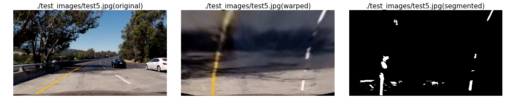

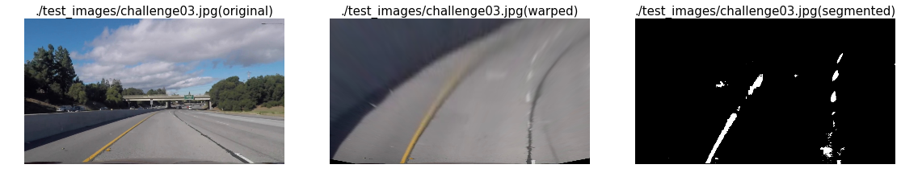

#### 4. Lane detection

##### 1. Initial window search
* Histogram from bottom half of image
* Filtering with median filter to reduce spikes
* Peak search with 
* weighted averaging of peaks to identify left and right starting point for lanes
* Creating windows to mark pixels considered for line fitting

##### 2. Fitting lines with RANSAC approach
Using the [RANSAC](https://en.wikipedia.org/wiki/Random_sample_consensus) method for data fitting improves robustness against outliers. Due to a rather simple segmentation there are plenty of outliers in the segmented image which might cause a bad fit, where lines have offsets or even bend into the wrong direction.
After a couple of tests this method was abolished because it was just too slow for testing, in the end the simple polyfit approach was good enough.

##### 3. Averaging line coefficients
In order to get a fit which is robust and flicker-free the coefficients as well as the calculated line x values were averaged over 10 fits using pythons `collections.deque` class. For example:
```python
    self.left_fit_buffer  = deque(maxlen=self.buffer_size)
    ....
    self.left_line.best_fit  = np.average(self.left_fit_buffer, axis=0)
```

##### 4. Plausability testing of line fits
The following cases were checked and if they occurred the lines were marked as not detected which causes a fresh window search in the next iteration.
* Check 1: check if lines are intersecting already within the unwarped image.
Sometimes it happens that both lines intersect within the image frame which is kind of nonsense, because we rather expect parallel or semi-parallel lines. Due to a fixed warp transformation we not only get parallel lines but also slightly converging lines when the slope of the street changes from the slope of the images where we got the warping transformation from.
* Check 2: check if apex point of left and right line fit is within a reasonable range.
It can be observed that the apex point of both lines never are in the negative y range, they are in fact always in the positive y range.
* Check 3: check if both line fits are the same.
Sometimes it also happens that the search for pixels associated with the left and right line converges on one side and then both lines have the same line fit.

#### 5. Calculation of radius of curvature of the lane and position of the vehicle with respect to center
The radius of curvature is computed for both lane lines using the equation: 
R_curve = (1+(2Ay+B)^2)^(3/2) / |2A|

Before computing the radius a line fit with metric world units was done by assuming 30 meters per 720 pixels in y and 3.7 meters per 700 pixels in x.
The radius of curvature is computed for both lines and the average curvature over 10 samples is reported.

For the calculation of the position of the vehicle with respect to the center first the position of each line with respect to the center is calculated in `self.left_line.line_base_pos` and `self.right_line.line_base_pos`.
Therefore each line is evaluated at `y = ysize` to get the x-coordinate of the lines, now for the left line this position is subtracted from the center (`xsize/2`) and for the right lane the center is subtracted from the x-coordinate of the line.
To get the car position with respect to the center only the right line position has to be subtracted from the left one.
If the resulting value is negative then the vehicle is located to the left of the lane, while if it is positive it is located to the right.

```python
    self.ym_per_pix =  30 / 720 # meters per pixel in y dimension
    self.xm_per_pix = 3.7 / 700 # meters per pixel in x dimension
    
    # Fit new polynomials also to x,y in world space
    left_fit_cr  = np.polyfit(ploty*self.ym_per_pix, self.left_line.bestx*self.xm_per_pix, 2)
    right_fit_cr = np.polyfit(ploty*self.ym_per_pix, self.right_line.bestx*self.xm_per_pix, 2)

    y_eval = ysize # evaluate curvature in the bottom of the image, close to the car

    # Calculate radius of curvature of the lines in meters
    left_curvature = (((1 + (2*left_fit_cr[0]*y_eval*self.ym_per_pix + left_fit_cr[1])**2)**1.5) /
                        np.absolute(2*left_fit_cr[0]))
    right_curvature = (((1 + (2*right_fit_cr[0]*y_eval*self.ym_per_pix + right_fit_cr[1])**2)**1.5) / 
                        np.absolute(2*right_fit_cr[0]))
    self.left_line_curv_buffer.append(left_curvature)
    self.right_line_curv_buffer.append(right_curvature)

    self.left_line.radius_of_curvature  = np.average(self.left_line_curv_buffer)
    self.right_line.radius_of_curvature = np.average(self.right_line_curv_buffer)

    # Calculate distance between image center and lines in meters
    left_fitx_cr  = np.polyval(left_fit_cr,  [y_eval*self.ym_per_pix])
    right_fitx_cr = np.polyval(right_fit_cr, [y_eval*self.ym_per_pix])
    self.left_line.line_base_pos  = self.xm_per_pix*xsize/2 - left_fitx_cr
    self.right_line.line_base_pos = right_fitx_cr - self.xm_per_pix*xsize/2
    
    car_lane_offset = self.left_line.line_base_pos - self.right_line.line_base_pos 
```

#### 6. Example output after window search

Here are two examples of how the window search was able to find the lane lines in difficult conditions:

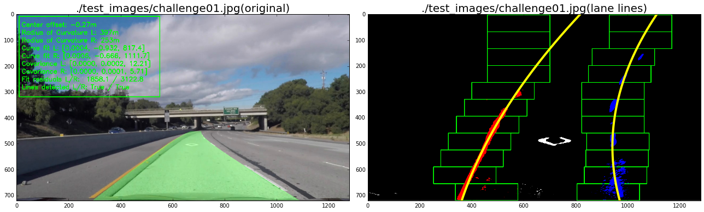

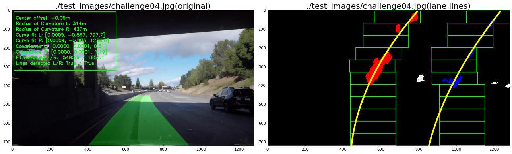


### Pipeline (video)


Here are the links to the processed videos:
* [project_video.mp4](videos_output/project_video.mp4)
* [challenge_video.mp4](videos_output/challenge_video.mp4)
* [harder_challenge_video.mp4](videos_output/harder_challenge_video.mp4)

### Discussion of issues with the current solution

Because the quality of the lane detection heavily depends on the lane line segmentation it is the weakest point in the whole pipeline. The thresholding of colour channels is not really the most robust and generic solution for all road and light conditions, it fails once the road is not evenly lit or even has some repaired damages.
* Lane detection: the outlier detection of my current solution has still some room for improvement.

